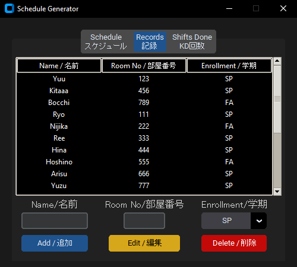

# Kitchen Duty Schedule Generator

#### About The Project:

A custom-built GUI desktop application that automates and improves the process of the Kitchen Duty scheduling for Resident Assistants at Ritsumeikan Asia Pacific University. Developed in response to a friend's request to streamline the scheduling workflow, this application alleviates the administrative burden of creating and managing a monthly duty roster manually.

The application provides a user-friendly interface allowing Resident Assistant to easily input student details, manage shifts, and generate an organized and balanced monthly schedule based on saved details. The schedule is generated on the user's Google Calendar where they are able to edit it as they please. This not only saves time but also ensures fairness in task distribution among the residents.

## Built With

- [![Python]][Python-url]
- **Tkinter** - The Python framework used for creating the GUI.
- **Google API** - Used to leverage Google's functionalities.

[Python]: https://img.shields.io/badge/Python-3776AB?style=for-the-badge&logo=python&logoColor=white
[Python-url]: https://www.python.org/

## Getting Started

**PLEASE READ THE SETUP GUIDE IN THE GUIDES FOLDER BEFORE ATTEMPTING TO USE THIS APP!!!**  
The details.json file is used to store the student records, it contains sample data to get the app started.  
**How your folder should look like before running the script:**
<kbd>  </kbd>

Along with the setup guide is a user manual to guide users on what they can do.

## Screenshots of the GUI and Generated Schedule

#### Schedule Tab:

#### Records Tab:

#### Shifts Done Tab:
Schedule not Generated     |  Schedule Generated
:-------------------------:|:-------------------------:
 | 

#### Generated Schedule Example:

<kbd>  </kbd>

## Features

#### Schedule Tab:

- Users can generate a schedule for a specific month and year
- Users can change the Google account which the schedule is written on

#### Records Tab:

- CRUD for student records
- Sort by Name, Room No and Enrollment

#### Shifts Done Tab:

- Display Shifts Done according to schedule generated
- Sort by Name or shifts Done

## Requests List (Additional details)

- Generate schedule monthly
- 2 dorm residents per day/night
- Avoid same pairs within the month
- Record to store name, room no and enrollment period
- Residents move in and out so records should be editable
- Max shifts in a month limited to 3
- Record of how many shifts done in a month for each resident (No recording needed, just display)
- In Google Calendar: Tangerine for fall students and lavendar for spring
- Allow Resident Assistants to make final changes to the schedule
- Make records and shifts done sortable

## Authors

Developed By: Chun ([@Lavenzaa](https://github.com/Lavenzaa))

Requested By: Jojo
